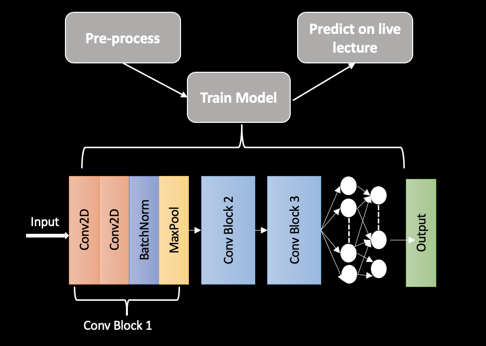

# AttentioNet

What if we were able to get a live feedback of an audience to know whether the content we deliver is as effective as it can be? The pandemic has brought drastic changes in terms of digitization of our day-to-day activities and one major area being the online education forum. It is easier for the instructors to assess the attention of their students in physical classrooms but becomes challenging in an online setup. 

AttentioNet is an attempt towards making this task easier by monitoring the activities of the students live and by providing proactive feedback to the instructor regarding the varying attention of their students.

## Data and labels 

We collected the data set provided by [University of Texas at Arlington](https://sites.google.com/view/utarldd/home), which consists of 180 videos, each of which were 10 minutes long. They were labelled into three classes:
-	alert (0)
-	low vigilant (5)
-	drowsy (10)

All of which were labelled by the participants themselves. For our purpose, we used just classes alert and drowsy to indicate attentiveness.

We computed mouth over eye aspect ratios to filter out captured images from the videos that we had from our dataset.

## Model architecture 

## Contributers 

- [Manisha R](https://github.com/Manisha2297)
- [Niegil Francis](https://github.com/Niegil-Francis)
- [Vipul Tanwar](https://github.com/vipultanwr)
- [Padmaja Bhagwat](https://github.com/PadmajaVB)
